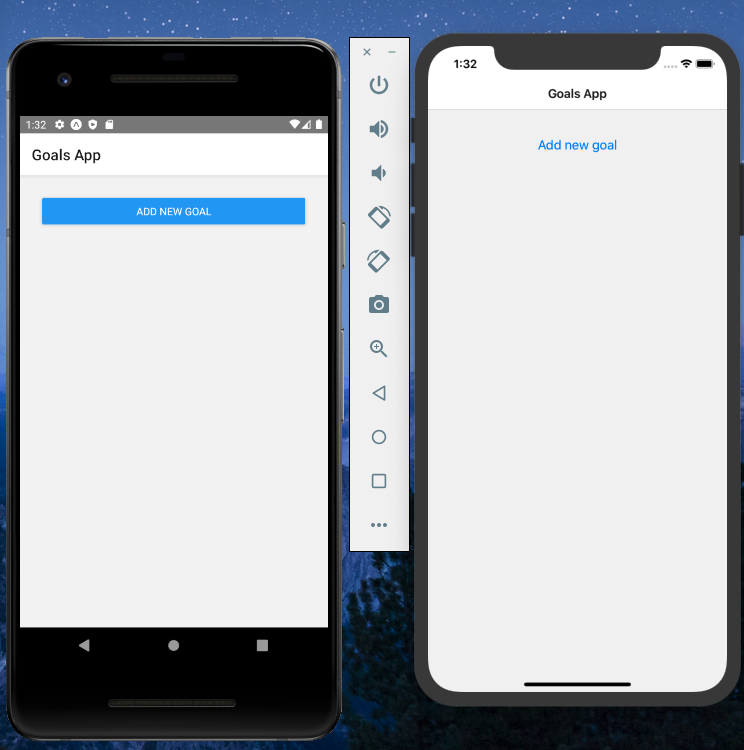
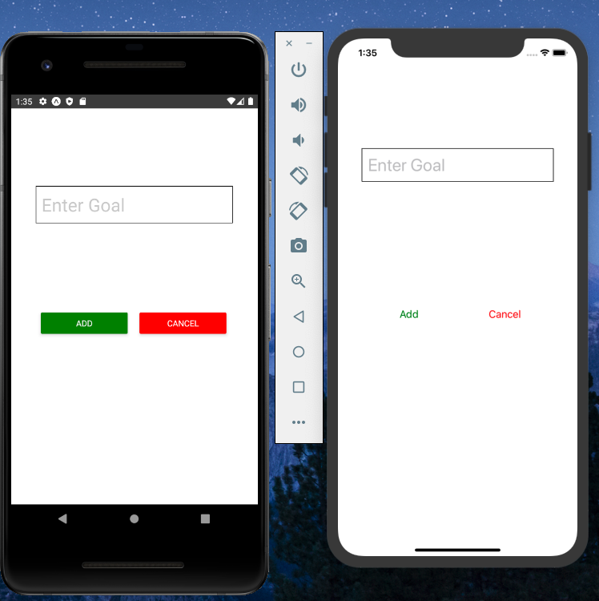
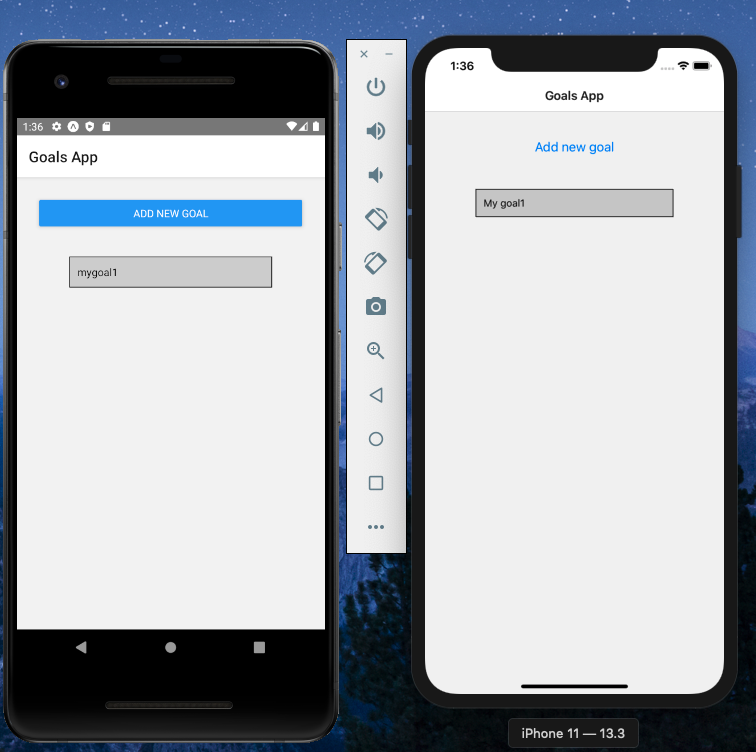

## Goals App

React native app to store your goals.

## Operation

The operation is pretty simple

When we try to add a new goal, we see a modal

When we enter the goal, the modal collapses and we can see our goal

